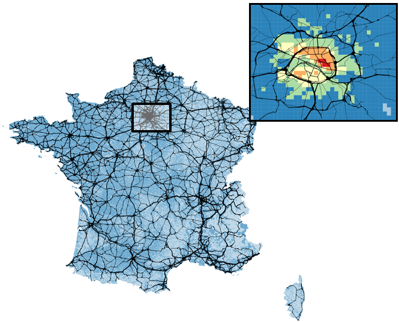

# ULTImodel

[](https://github.com/DLR-VF/ULTImodel/blob/master/LICENSE)
[](https://pypi.python.org/pypi/ultimodel)
[](https://ultimodel.readthedocs.io/en/latest/?badge=latest)
[](https://doi.org/10.5281/zenodo.7826486)
 
**ULTImodel** &mdash; A universal transport distribution model written in Python.

## Description
**ULTImodel** is a distribution model that helps to spatially distribute road-based transport for countries, including border-crossing travel. It is set up using open data like [OSM](https://openstreetmap.org).
The software includes modules for network generation, trip generation and trip distribution based on two main inputs:

* Georeferenced traffic analysis zones (TAZ) for the respective region
* Target value for national transport volume (i.e. person-kilometres or tonne-kilometres)



## Installation

The __current version__ is [ultimodel-1.0.0](https://github.com/DLR-VF/ULTImodel/releases/tag/1.0.0).

You may __install ULTImodel__ by executing the following

__pip__
```console
python -m pip install ultimodel
```

You may __download a copy or fork the code__ at [ULTImodel&apos;s github page](link-to-github).

Besides, you may __download the current release__ here:

* [ultimodel-1.0.1.zip](https://github.com/DLR-VF/ULTImodel/archive/refs/tags/1.0.1.zip)
* [ultimodel-1.0.1.tar.gz](https://github.com/DLR-VF/ULTImodel/archive/refs/tags/1.0.1.tar.gz)


## Usage
Examples of using **ULTImodel** can be found in the [tutorials repository](https://github.com/DLR-VF/ULTImodel-tutorials).

Additional documentation can be found at <https://ultimodel.readthedocs.io/>.


## Authors and acknowledgment
**ULTImodel** was developed by Nina Thomsen.

We want to thank the following persons for the help during **ULTImodel's** development: Lars Hedemann, Simon Metzler, Gernot Liedtke, Christian Winkler, Tudor Mocanu, and Daniel Krajzewicz.

## License
**ULTImodel** is licensed under the [MIT license](https://github.com/DLR-VF/ULTImodel/blob/master/LICENSE).

## Links
Please find further information on the web:

* The complete documentation is located at <https://ultimodel.readthedocs.io/>
* The github repository is located at <https://github.com/DLR-VF/ULTImodel>
* The issue tracker is located at <https://github.com/DLR-VF/ULTImodel/issues>

## Legal

Please find the legal information here: <https://github.com/DLR-VF/ULTImodel/blob/master/ultimodel-mkdocs/docs/legal.md>


