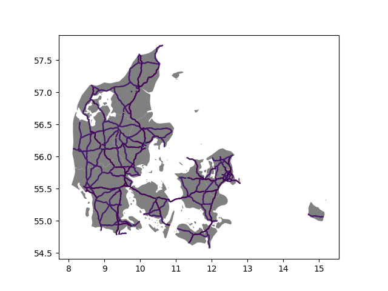
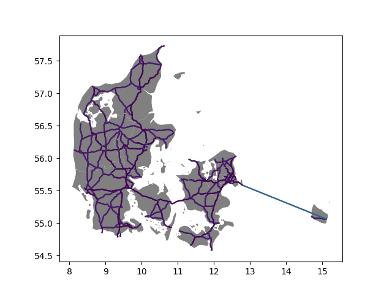
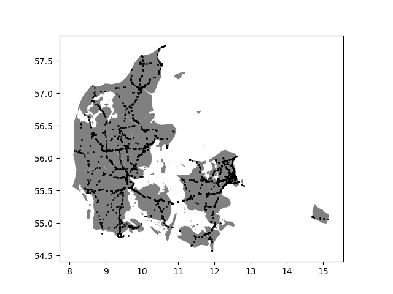
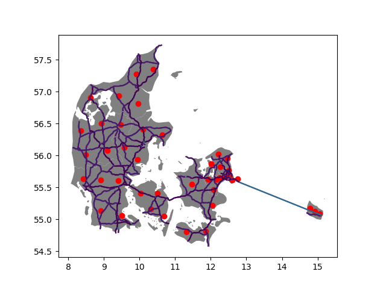
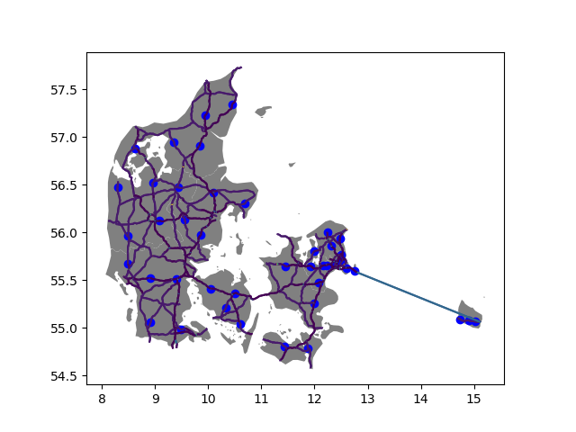

# Network

A network created in ULTIMO consists of edges and nodes and is extracted from OSM and is
created using `network.CreateNetwork`.

## Edges

Preparation: read TAZ GeoDataFrame
```python
import network.CreateNetwork as CreateNetwork
import geopandas as gpd

taz = gpd.GeoDataFrame.from_file('DK-taz.gpkg')

taz.head()

>>> output

	nuts_id 	cntr_code 	nuts_name 	        geometry
0 	DK011 	    DK 	        Byen København 	    MULTIPOLYGON (((12.50479 55.63734, 12.48025 55...
1 	DK012 	    DK 	        Københavns omegn 	MULTIPOLYGON (((12.24627 55.70664, 12.25874 55...
2 	DK013 	    DK 	        Nordsjælland 	    MULTIPOLYGON (((12.24627 55.70664, 12.21994 55...
3 	DK014 	    DK 	        Bornholm 	        MULTIPOLYGON (((14.88943 55.22813, 14.94373 55...
4 	DK021 	    DK 	        Østsjælland 	    MULTIPOLYGON (((12.24627 55.70664, 12.16537 55...
```

Create `network_edges` as base for operations, based on `taz`:
```python
network_edges = CreateNetwork.Edges(country='DK', taz=taz, taz_cn='cntr_code')
```

From `taz`, create country polygon(s) for `network_edges`. If there are islands, the country will
have multiple polygons.
```python
polygons = network_edges.get_polygon(taz_id='nuts_id')
polygons

>>> output

		nuts_id 	cntr_code 	nuts_name 	    geometry
0 	0 	DK011 	    DK 	        Byen København 	POLYGON ((8.19409 56.72190, 8.18723 56.75394, ...
1 	    DK011 	    DK 	        Byen København 	POLYGON ((14.66314 55.19035, 14.66356 55.19231...
```

Get edges for selected OSM highway types for the polygons in `polygons`; 
returns number of polygons with edges (not necessarily all polygons in `polygons` have edges)

```python
n_poly = network_edges.get_edges(filter_highway=["motorway", "trunk", "primary"], polygons=polygons)
n_poly

>>> 2
```
The edges can be found in `network_edges.edges`
```python
network_edges.edges.head()

>>> output

	highway 	speed_kph 	geometry 	                                        index
0 	primary 	63.0 	    LINESTRING (8.75547 55.16922, 8.75502 55.16959... 	NaN
1 	primary 	63.0 	    LINESTRING (8.75547 55.16922, 8.75591 55.16884... 	NaN
2 	primary 	80.0 	    LINESTRING (8.75496 55.31883, 8.75514 55.32270... 	NaN
3 	primary 	63.0 	    LINESTRING (8.75496 55.31883, 8.75013 55.31339... 	NaN
4 	primary 	63.0 	    LINESTRING (8.75496 55.31883, 8.76117 55.32033... 	NaN                     
```

`set_attributes` creates a unique ID, calculates length and travel time and assigns a type number

```python
network_edges.set_attributes(taz_id='nuts_id', start_id=1)
network_edges.edges.head()

>>> output

		highway 	speed_kph 	index 	nuts_id 	geometry 	                                        length 	    tt 	    ultimo_id 	type
0 	0 	primary 	63.0 	    NaN 	DK032 	    LINESTRING (8.75547 55.16922, 8.75502 55.16959... 	17.558210 	1003.0 	1 	        3
1 	0 	primary 	63.0 	    NaN 	DK032 	    LINESTRING (8.75547 55.16922, 8.75591 55.16884... 	7.344446 	420.0 	2 	        3
2 	0 	primary 	80.0 	    NaN 	DK032 	    LINESTRING (8.75496 55.31883, 8.75514 55.32270... 	2.645051 	119.0 	3 	        3
3 	0 	primary 	63.0 	    NaN 	DK032 	    LINESTRING (8.75496 55.31883, 8.75013 55.31339... 	17.558210 	1003.0 	4 	        3
4 	0 	primary 	63.0 	    NaN 	DK032 	    LINESTRING (8.75496 55.31883, 8.76117 55.32033... 	19.593661 	1120.0 	5 	        3           
```

Using the nodes created based on the edges (see section __Nodes__), the start and end node
per edge are added and the columns are reduced to the relevant info.

```python
network_edges.set_nodes(nodes, order_col="order", linkid_col="LinkID", nodeid_col="node_id")
network_edges.edges.head()

>>> output

	ultimo_id 	from_node 	to_node 	type 	nuts_id 	length 	speed_kph 	tt 	    geometry
0 	1 	        1246 	    1245 	    3 	    DK032 	    17.558210 	63.0 	1003.0 	LINESTRING (8.75547 55.16922, 8.75502 55.16959...
1 	2 	        1246 	    1263 	    3 	    DK032 	    7.344446 	63.0 	420.0 	LINESTRING (8.75547 55.16922, 8.75591 55.16884...
2 	3 	        1245 	    1248 	    3 	    DK032 	    2.645051 	80.0 	119.0 	LINESTRING (8.75496 55.31883, 8.75514 55.32270...
3 	4 	        1245 	    1246 	    3 	    DK032 	    17.558210 	63.0 	1003.0 	LINESTRING (8.75496 55.31883, 8.75013 55.31339...
4 	5 	        1245 	    1399 	    3 	    DK032 	    19.593661 	63.0 	1120.0 	LINESTRING (8.75496 55.31883, 8.76117 55.32033...               
```



Connect subgraphs in the network (isolated networks) and remove isolated edges and nodes 
to ensure that the edges are routable with `connect_subgraphs`. The input is either 
`network_edges.edges` or a separate `GeoDataFrame` with edges and unique network nodes 
`nodes_unique`.

```python
final_network, final_nodes = network_edges.connect_subgraphs(nodes=nodes_unique)

>>> Connecting 8 sub graphs...

print(len(network_edges.edges), len(final_network))
final_network.head()

>>> output
3550 3538
	ultimo_id 	from_node 	to_node 	type 	nuts_id 	length 	    speed_kph 	tt 	    geometry
0 	1 	        1246 	    1245 	    3 	    DK032 	    17.558210 	63.0 	    1003.0 	LINESTRING (8.75547 55.16922, 8.75502 55.16959...
1 	2 	        1246 	    1263 	    3 	    DK032 	    7.344446 	63.0 	    420.0 	LINESTRING (8.75547 55.16922, 8.75591 55.16884...
2 	3 	        1245 	    1248 	    3 	    DK032 	    2.645051 	80.0 	    119.0 	LINESTRING (8.75496 55.31883, 8.75514 55.32270...
3 	4 	        1245 	    1246 	    3 	    DK032 	    17.558210 	63.0 	    1003.0 	LINESTRING (8.75496 55.31883, 8.75013 55.31339...
4 	5 	        1245 	    1399 	    3 	    DK032 	    19.593661 	63.0 	    1120.0 	LINESTRING (8.75496 55.31883, 8.76117 55.32033...           

print(len(nodes_unique), len(final_nodes))
final_nodes.head()

>>> output

	node_id 	num_links 	geometry
0 	1 	        2 	        POINT (10.00132 55.71526)
1 	2 	        2 	        POINT (10.00162 55.42639)
2 	3 	        2 	        POINT (10.00209 56.44808)
3 	4 	        2 	        POINT (10.00478 56.44625)
4 	5 	        2 	        POINT (10.00589 57.50701)
```



## Nodes

The class `Nodes` in `CreateNetwork` creates Nodes at the ends of each edge. Using a 
`GeoDataFrame` `edges` (can be created with __Edges__), the `network_nodes` instance is created.

```python
import network.CreateNetwork as CreateNetwork
import geopandas as gpd

edges = gpd.GeoDataFrame.from_file('edges.gpkg')
edges.head()

>>> output

		highway 	speed_kph 	index 	nuts_id 	geometry 	                                        length 	    tt 	    ultimo_id 	type
0 	0 	primary 	63.0 	    NaN 	DK032 	    LINESTRING (8.75547 55.16922, 8.75502 55.16959... 	17.558210 	1003.0 	1 	        3
1 	0 	primary 	63.0 	    NaN 	DK032 	    LINESTRING (8.75547 55.16922, 8.75591 55.16884... 	7.344446 	420.0 	2 	        3
2 	0 	primary 	80.0 	    NaN 	DK032 	    LINESTRING (8.75496 55.31883, 8.75514 55.32270... 	2.645051 	119.0 	3 	        3
3 	0 	primary 	63.0 	    NaN 	DK032 	    LINESTRING (8.75496 55.31883, 8.75013 55.31339... 	17.558210 	1003.0 	4 	        3
4 	0 	primary 	63.0 	    NaN 	DK032 	    LINESTRING (8.75496 55.31883, 8.76117 55.32033... 	19.593661 	1120.0 	5 	        3
```
```python
network_nodes = CreateNetwork.Nodes(edges=edges)
```

The initial node geometries are created with `create_nodes`, resulting in a `GeoDataFrame`
with the edge ID and position of the node (order, start or destination).

```python
network_nodes.create_nodes(id_col="ultimo_id", geom_col="geometry")
network_nodes.nodes.head()

>>> output

	LinkID 	order 	geometry
0 	1 	    0 	POINT (8.75547 55.16922)
1 	1 	    1 	POINT (8.75496 55.31883)
2 	2 	    0 	POINT (8.75547 55.16922)
3 	2 	    1 	POINT (8.81108 55.11278)
4 	3 	    0 	POINT (8.75496 55.31883)    
```

To remove duplicates, the coordinates of all the start and end nodes are compared in 
`remove_duplicates` and a `GeoDataFrame` with all unique nodes is produced.

```python
network_nodes.remove_duplicates()
network_nodes.nodes_unique.head()

>>> output

	xy 	                                        num_links 	geometry
0 	[(10.001318200000002, 55.715256698015416)] 	2 	        POINT (10.00132 55.71526)
1 	[(10.001617600000001, 55.42638559797401)] 	2 	        POINT (10.00162 55.42639)
2 	[(10.002085100000008, 56.44808009811454)] 	2 	        POINT (10.00209 56.44808)
3 	[(10.004784400000002, 56.446253498114366)] 	2 	        POINT (10.00478 56.44625)
4 	[(10.005892199999995, 57.50701369824364)] 	2 	        POINT (10.00589 57.50701)       
```

Based on these unique nodes, IDs are created in `set_node_id`.

```python
network_nodes.set_node_id(id_col='node_id', start=1)
network_nodes.nodes_unique.head()

>>> output

	node_id 	num_links 	geometry
0 	1 	        2 	POINT (10.00132 55.71526)
1 	2 	        2 	POINT (10.00162 55.42639)
2 	3 	        2 	POINT (10.00209 56.44808)
3 	4 	        2 	POINT (10.00478 56.44625)
4 	5 	        2 	POINT (10.00589 57.50701)   

---

network_nodes.nodes.head()

>>> output

	node_id 	LinkID 	order 	geometry
0 	1246 	    1 	    0 	    POINT (8.75547 55.16922)
1 	1245 	    1 	    1 	    POINT (8.75496 55.31883)
2 	1246 	    2 	    0 	    POINT (8.75547 55.16922)
3 	1263 	    2 	    1 	    POINT (8.81108 55.11278)
4 	1245 	    3 	    0 	    POINT (8.75496 55.31883)
```



## Connectors
Preparation: read TAZ `GeoDataFrame` and population `GeoDataFrame`
```python
import network.CreateNetwork as CreateNetwork
import geopandas as gpd

taz = gpd.GeoDataFrame.from_file('DK-taz.gpkg')

taz.head()

>>> output

	nuts_id 	cntr_code 	nuts_name 	        geometry
0 	DK011 	    DK 	        Byen København 	    MULTIPOLYGON (((12.50479 55.63734, 12.48025 55...
1 	DK012 	    DK 	        Københavns omegn 	MULTIPOLYGON (((12.24627 55.70664, 12.25874 55...
2 	DK013 	    DK 	        Nordsjælland 	    MULTIPOLYGON (((12.24627 55.70664, 12.21994 55...
3 	DK014 	    DK 	        Bornholm 	        MULTIPOLYGON (((14.88943 55.22813, 14.94373 55...
4 	DK021 	    DK 	        Østsjælland 	    MULTIPOLYGON (((12.24627 55.70664, 12.16537 55...

# read population
pop = gpd.GeoDataFrame.from_file('4326-points-population.gpkg')

pop.head()

>>> output

	VALUE 	    cntr_code 	geometry
0 	0.000000 	DK 	        POINT (12.52891 55.58360)
1 	0.063969 	DK 	        POINT (12.53872 55.58360)
2 	0.063969 	DK 	        POINT (12.54852 55.58360)
3 	0.000000 	DK 	        POINT (12.55832 55.58360)
4 	1152.648 	DK 	        POINT (12.56812 55.58360)
```

Initialize the connector class with

```python
conn_ = CreateNetwork.Connectors()
```

Determine population centers 

```python
conn_.find_connector_locations(taz, pop, taz_geom='geometry')
conn_.connectors.head()

>>> output

	nuts_id 	c_n 	weight 	    geometry
0 	DK011 	    0 	    0.000048 	POINT (12.76171 55.63546)
1 	DK011 	    1 	    0.785301 	POINT (12.53487 55.68012)
2 	DK011 	    2 	    0.214651 	POINT (12.60310 55.61478)
0 	DK012 	    3 	    0.493351 	POINT (12.39750 55.67478)
1 	DK012 	    4 	    0.103410 	POINT (12.24445 55.65573)

```



Move population centers to network nodes

```python
nodes = gpd.GeoDataFrame.from_file('unique-nodes.gpkg')
# add country code to nodes
nodes['cntr_code'] = 'DK'

>>> output

	node_id 	num_links 	geometry
0 	1 	        2 	POINT (10.00132 55.71526)
1 	2 	        2 	POINT (10.00162 55.42639)
2 	3 	        2 	POINT (10.00209 56.44808)
3 	4 	        2 	POINT (10.00478 56.44625)
4 	5 	        2 	POINT (10.00589 57.50701)   

all_conn = conn_.identify_connector_nodes(nodes=nodes, zone='nuts_id', weight="weight", country_check='cntr_code')
all_conn.head()

>>> output
No duplicates detected!
	node_id 	geometry 	                nuts_id 	c_n 	weight
0 	1095 	    POINT (12.74977 55.60094) 	DK011 	    0 	    0.000048
1 	1014 	    POINT (12.51936 55.70192) 	DK011 	    1 	    0.785301
2 	1078 	    POINT (12.60314 55.62947) 	DK011 	    2 	    0.214651
3 	890 	    POINT (12.39536 55.67467) 	DK012 	    3 	    0.493351
4 	777 	    POINT (12.23742 55.65711) 	DK012 	    4 	    0.103410    

```


