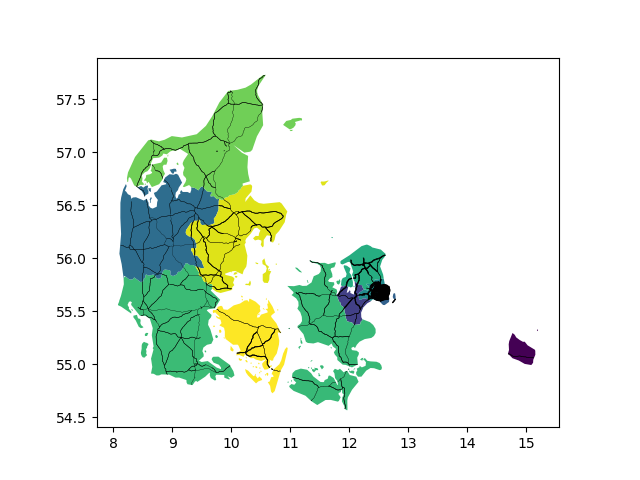
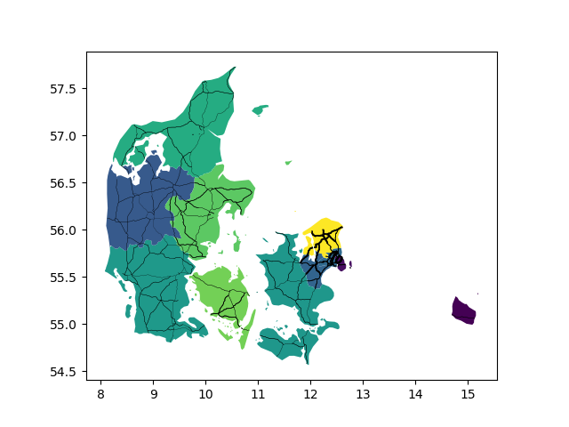

# Distribution

The distribution in **ULTImodel** is performed with `distribution.DistributeTraffic`.

## Target values

Using the class `TargetValues`, the total travel volume is split into the four sectors
national long- and short distance and international OD and transit.

Input: country `DataFrame` with attributes for classification and totals.

```python
import distribution.DistributeTraffic as DistributeTraffic

import pandas as pd

country_layer = pd.read_csv('country_layer.csv')
country_layer.head()

>>> output

	cntr_code 	index 	border_share 	border_length 	border_length_shared 	border_crossings_count 	neighbors 	population 	    area            car_mio_pkm  freight_mio_tkm
1 	DK 	 	    0 	    0.015467 	    4088.436575 	63.236291 	            5.0 	                2 	        8.396369e+06 	43653.093630    60000        15000
2 	FI 	 	    0 	    0.269796 	    8715.390137 	2351.374349 	        136.0 	                3 	        9.547163e+06 	337512.028767   65000        17000
3 	NO 		    0 	    0.101108 	    24434.055949 	2470.468692 	        176.0 	                3       	8.527085e+06 	322504.893423   65000        20000
5 	SE 	 	    0 	    0.213012 	    9981.249404 	2126.124196 	        128.0 	                3 	        1.621385e+07 	449736.409751   100000       50000
```

Initialize with `TargetValues` and the `country_layer` 

```python
tv = DistributeTraffic.TargetValues(country_layer)
```

Target values for personal transport in person kilometers traveled for `DK`

```python
pt=tv.targets_personal_transport(cn='DK', target_col='car_mio_pkm')
pt

>>> output

{'short': 38917497147.80412,
 'long': 20929430184.74586,
 'int': 146360460.06437054,
 'trans': 6712207.385638687}
```

Target values for freight transport in vehicle kilometers traveled and trips for `DK`, 
short-distance is further subdivided in sectors (LCV, MFT, HFT)

```python
ft=tv.targets_freight_transport(cn='DK', target_col='freight_mio_tkm')

>>> output

{'lcv': 2400000000.0,
 'mft': 449999999.99999994,
 'hft': 273347783.1152192,
 'trips_short': 79150845.0484885,
 'long': 461086483.1505175,
 'trips_long': 3347303.631950553,
 'int': 416644412.4854073,
 'trips_int': 3024671.9565818245,
 'trans': 93921321.24885575,
 'trips_trans': 403289.59421090997}
```

## Gravity model

Long-distance trips are distributed with `GravityModel`, producing an OD trip matrix.

Input: TAZ `GeoDataFrame` with attraction attributes, cost matrix `np.array`, target values
(see __TargetValues__)

```python
import distribution.DistributeTraffic as DistributeTraffic

import geopandas as gpd
import numpy as np

taz = gpd.GeoDataFrame.from_file('DK-taz-atts.gpkg')

taz.head()

>>> output

	nuts_id 	cntr_code 	nuts_name 	        geometry 	                                        population 	    index_nat 	index_int 	id 	length
0 	DK011 	    DK 	        Byen København 	    MULTIPOLYGON (((12.50479 55.63734, 12.48025 55... 	1.199214e+06 	0.588597 	0.676324 	0 	19.055466
1 	DK012 	    DK 	        Københavns omegn 	MULTIPOLYGON (((12.24627 55.70664, 12.25874 55... 	8.048375e+05 	0.749279 	0.860955 	1 	111.140495
2 	DK013 	    DK 	        Nordsjælland 	    MULTIPOLYGON (((12.24627 55.70664, 12.21994 55... 	6.529701e+05 	0.665808 	0.765043 	2 	367.978524
3 	DK014 	    DK 	        Bornholm 	        MULTIPOLYGON (((14.88943 55.22813, 14.94373 55... 	4.738833e+04 	0.091693 	0.105359 	3 	59.449975
4 	DK021 	    DK 	        Østsjælland 	    MULTIPOLYGON (((12.24627 55.70664, 12.16537 55... 	3.613609e+05 	0.392641 	0.451162 	4 	134.617609

cost_mtx = np.load('cost-matrix.npy')
cost_mtx.shape # (origin, destination, cost), cost: 0=travel time, 1=distance

>>> (69, 69, 2)

pt = {'short': 38917497147.80412,
      'long': 20929430184.74586,
      'int': 146360460.06437054,
      'trans': 6712207.385638687}

ft = {'lcv': 2400000000.0,
     'mft': 449999999.99999994,
     'hft': 273347783.1152192,
     'trips_short': 79150845.0484885,
     'long': 461086483.1505175,
     'trips_long': 3347303.631950553,
     'int': 416644412.4854073,
     'trips_int': 3024671.9565818245,
     'trans': 93921321.24885575,
     'trips_trans': 403289.59421090997} 
```

Initialize with `GravityModel`

```python
gm = DistributeTraffic.GravityModel(cost_mtx, taz, taz_cn='cntr_code')
```

Personal transport trip matrix

```python
trips_pt = gm.trip_distribution_pt(target=pt['long'], cn=cn, mob_rate=25, occ_rate=1.3)  # cars (personal transport)
trips_pt[:3, :3]

>>> output 
Scaling factor personal transport for DK: 0.940780924347826
array([[       0.        , 12769235.98231415,  4371570.57699052],
       [14108225.57493652,        0.        ,  3533537.04995944],
       [ 3868113.92794895,  3632011.70280941,        0.        ]])
```

Freight transport trip matrix

```python
trips_ft = gm.trip_distribution_ft(target_vkt=ft['long'], target_trips=ft['trips_long'], cn=cn)  # trucks (freight transport)
trips_ft[:3,:3]

>>> output
Freight transport gravity model result for DK: Relation to target vkm 0.7624308514138889
array([[    0.        , 30357.34659726, 25671.69472289],
       [30455.28146353,     0.        , 33256.92980559],
       [25480.89080153, 33418.32286164,     0.        ]])
```

## Intrazonal trips

Short-distance trips are assigned to the road network within a cell (single) or within 
multiple cell within a pre-defined distance (multiple). The VKT are equally distributed
using weights for road types.

Input: TAZ `GeoDataFrame` with attraction attributes, network edges `GeoDataFrame`, target values
(see __TargetValues__)

```python
import distribution.DistributeTraffic as DistributeTraffic

import geopandas as gpd

taz = gpd.GeoDataFrame.from_file('DK-taz-atts.gpkg')

taz.head()

>>> output

	nuts_id 	cntr_code 	nuts_name 	        geometry 	                                        population 	    index_nat 	index_int 	id 	length
0 	DK011 	    DK 	        Byen København 	    MULTIPOLYGON (((12.50479 55.63734, 12.48025 55... 	1.199214e+06 	0.588597 	0.676324 	0 	19.055466
1 	DK012 	    DK 	        Københavns omegn 	MULTIPOLYGON (((12.24627 55.70664, 12.25874 55... 	8.048375e+05 	0.749279 	0.860955 	1 	111.140495
2 	DK013 	    DK 	        Nordsjælland 	    MULTIPOLYGON (((12.24627 55.70664, 12.21994 55... 	6.529701e+05 	0.665808 	0.765043 	2 	367.978524
3 	DK014 	    DK 	        Bornholm 	        MULTIPOLYGON (((14.88943 55.22813, 14.94373 55... 	4.738833e+04 	0.091693 	0.105359 	3 	59.449975
4 	DK021 	    DK 	        Østsjælland 	    MULTIPOLYGON (((12.24627 55.70664, 12.16537 55... 	3.613609e+05 	0.392641 	0.451162 	4 	134.617609

edges = gpd.GeoDataFrame.from_file('edges.gpkg')
edges.head()

>>> output

		highway 	speed_kph 	index 	nuts_id 	geometry 	                                        length 	    tt 	    ultimo_id 	type
0 	0 	primary 	63.0 	    NaN 	DK032 	    LINESTRING (8.75547 55.16922, 8.75502 55.16959... 	17.558210 	1003.0 	1 	        3
1 	0 	primary 	63.0 	    NaN 	DK032 	    LINESTRING (8.75547 55.16922, 8.75591 55.16884... 	7.344446 	420.0 	2 	        3
2 	0 	primary 	80.0 	    NaN 	DK032 	    LINESTRING (8.75496 55.31883, 8.75514 55.32270... 	2.645051 	119.0 	3 	        3
3 	0 	primary 	63.0 	    NaN 	DK032 	    LINESTRING (8.75496 55.31883, 8.75013 55.31339... 	17.558210 	1003.0 	4 	        3
4 	0 	primary 	63.0 	    NaN 	DK032 	    LINESTRING (8.75496 55.31883, 8.76117 55.32033... 	19.593661 	1120.0 	5 	        3

pt = {'car': 38917497147.80412}

ft = {'lcv': 2400000000.0,
     'mft': 449999999.99999994,
     'hft': 273347783.1152192,
     'trips_short': 79150845.0484885} 
```

Initialize with `IntraZonal`

```python
iz = DistributeTraffic.IntraZonal(taz, edges)
```

Assign VKT from target to network by determining VKT per TAZ and distributing said VKT on
all roads within the TAZ with `road_type_weighted_single`

```python
net_r, taz_r = iz.road_type_weighted_single(target=pt, veh_types=['car'])

net_r[['ulitmo_id', 'nuts_id', 'car_short']].head()

>>> output

	ultimo_id 	nuts_id 	car_short
0 	1 	        DK032 	    2.845761e+06
1 	2 	        DK032 	    2.845761e+06
2 	3 	        DK032 	    2.845761e+06
3 	4 	        DK032 	    2.845761e+06
4 	5 	        DK032 	    2.845761e+06

taz_r[['nuts_id', 'car_sub']].head()

>>> output

	nuts_id 	car_sub
0 	DK011 	    3.445021e+08
1 	DK012 	    5.091953e+08
2 	DK013 	    6.505540e+08
3 	DK014 	    3.849412e+07
4 	DK021 	    2.271284e+08
```



Assign VKT from target to network by determining VKT per TAZ and distributing said VKT on
all roads within the TAZ and surrounding TAZ within a pre-defined distance with `road_type_weighted_multiple`. 
It is possible to set a higher weight to the main TAZ during assignment. 

The distance between TAZ is based on the distance matrix. Furthermore, the area of each TAZ 
in km² is calculated so that smaller TAZ are guaranteed to have their surroundings included.

```python
# read distance matrix
distance_mtx = np.load('distance-matrix.npy')

# calculate area
iz.taz.to_crs(epsg=3035, inplace=True)
iz.taz['area'] = iz.taz.area  # area per TAZ (smaller TAZ always get surrounding TAZ included, independent from distance)
iz.taz.to_crs(epsg=4326, inplace=True)

# intrazonal assignment
net_r, taz_r = iz.road_type_weighted_multiple(target=pt, matrix_dis=distance_mtx, veh_types=['car'], 
                                               weights = pd.DataFrame({'type': [0, 1, 2, 3], 'weight': [0.75, 1.5, 3.5, 3.5]}),
                                               index='population', fac_cell=1.5, distance=50000, occ_rate=1.3)
net_r[['ultimo_id', 'nuts_id', 'car_short']].head()

>>> output

	ultimo_id 	nuts_id 	car_short
0 	1 	        DK032 	    2.189047e+06
1 	2 	        DK032 	    2.189047e+06
2 	3 	        DK032 	    2.189047e+06
3 	4 	        DK032 	    2.189047e+06
4 	5 	        DK032 	    2.189047e+06


taz_r.head()

>>> output

	car_sub 	    nuts_id
0 	6.505052e+07 	DK011
1 	3.573749e+08 	DK012
2 	9.930296e+08 	DK013
3 	2.961086e+07 	DK014
4 	3.355154e+08 	DK021

```


