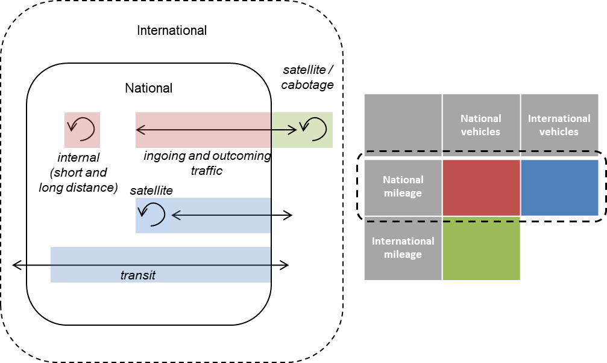

# Usage

ULTImodel modules can be imported as functions in python scripts. Following the described 
model steps, ULTImodel produces:

* an OD-Matrix in the form of an `np.array` for long-distance transport 
* a `gpd.GeoDataFrame` with network loads for short-distance transport 

## Model Steps

__Input:__ 

* `gpd.GeoDataFrame` with TAZ for regarded countries 
* `pd.DataFrame` with target travel volumes per country
* `gpd.GeoDataFrame` with population density (points) 

__Network Module:__

1. Generate routable network per country
2. Aggregate total network length for subordinate network per TAZ 
3. Connect international road network
4. Set connector points for TAZ based on population density

__GenerationData Module:__

1. Generate attraction and trip generation indices per TAZ
2. Calculate country attributes for international classification
3. Generate cost matrices between TAZ using the previously defined connector points

__Distribution Module__

1. Determine target values for VKT (vehicle kilometres travelled) for different transport types
2. Long-distance distribution of traffic to create OD trip matrix
3. Short-distance distribution of traffic to create road network with traffic loads for inner cell travel
4. International distribution of traffic to create OD trip matrix 

## Transport types

ULTImodel differentiates between 4 transport types:

| National | International |
|---|---|
|short distance | import-export (incoming, outgoing)|
|long distance|transit|

__National long-distance travel__

This type includes trips that are longer than 30km for cars and 50km for trucks, thus is 
distributed between TAZ using a gravity model and cost matrices (travel times, distances).
The result is an OD trip matrix as `np.array`, which can be assigned to the road network
using traffic assignment software.

The OD trip matrix is created using a gravity model, which was developed using microscopic trip
data sets for Germany. While the parameters can be adjusted, the general structure of the
distribution functions is currently not flexible.

__National short-distance travel__

In ULTImodel, short-distance trips are defined as inner cell trips. In order to distribute these,
there are two different options:

* Equal distribution on the road network, weighted by road type
* Gravity model between TAZ connector points and shortest-path assignment on the road network *(not available in v1.0)*

The result of the short-distance distribution is a `gpd.GeoDataFrame` of the road network including 
traffic loads.

__International travel__

In this step, both import-export and transit VKT are distributed using a gravity model. The
difference to national long-distance travel is that all inner-country relation are blocked.
The result is an OD trip matrix as `np.array`, which can be assigned to the road network
using traffic assignment software.

## Modes
Currently, ULTImodel is calibrated to distribute road-based transport. There, both personal and 
freight transport are regarded. Freight transport is further split into the three segments,
leading to a total of four modes:

* car 
* LCV (light commercial vehicles)
* MFT (medium freight transport)
* HFT (heavy freight transport)

While determining the target VKT, tkm shares and average loads per segment are regarded. They
can be adjusted as part of the `target` method.

## Target values

ULTImodel uses target values in the form of person kilometers traveled (__PKT__) and tonne kilometers
(__tkm__) on a national scale. These have to be provided as an external input and are currently
not calculated as part of the model. They include all travel volumes within a country, i.e
national travel by national and international vehicles.

For the distribution of the different modes and transport types, the total travel volumes
are split among the different types (national long- and short-distance, international OD 
and transit). This is based on a categorization of countries based on geospatial attributes
influencing border-crossing road-based transport, like the share of land borders or number 
of neighbor countries. 

For freight transport, average travel distances for the transport types are derived based 
on a country's area. Further, the share of different vehicle categories (like light, medium and
heavy freight vehicles) and their respective loads are used to generate total vehicle trips
per segment. The vehicle types and their shares and loads can be defined in the function 
parameters. As a result, transport type targets fo freight are transformed to vehicle kilometers
traveled (__VKT__) and trips.

Personal transport type targets are given in PKT (i.e. the unit of the overall input target) and
transformed to vehicle kilometers traveled (__VKT__) using occupancy rates in the distribution
functions.

## Gravity model structure

The main structure of the gravity model for long distance and international transport can be described as

| Type | Formula | Cost Function |
|---|---|---|
| Personal transport |^{\alpha}&space;f(c_{ij}))|&space;=&space;c^{\gamma})|
| Freight transport |)|&space;=&space;exp(-\beta&space;c_{ij}))| 

with  and  being 
attraction factors of the origin and destination cells. With ULTImodel, it is possible to select an individual attribute or 
create an attraction index consisting of population and industrial areas (from OSM). The balancing factor  
can have different values for each cell or country and can even depend on the cell being an origin or a destination.

The cost of travel can be measured in travel time or distance. The cost function ) 
is thus a decreasing function of the travel times and distances, implying that higher distances and times make a destination 
less attractive. In the cost function,  is the distance or travel time 
between the cells i and j. The  and  
parameters can be estimated using trip distance distributions.

### Attraction index

ULTImodel offers to calculate population per TAZ based on a point layer, which can be used as attraction factors. Furthermore,
there is another function available extracting industrial areas from OSM and combining them with population to form an 
attraction index. The index is calculated with a Cobb-Douglas function:

with 

|  Variable |  |
|---|---|
|  | *optional* scaling factor |
||parameters for population, industrial area and number of sites|
||population per zone|
||aggregated industrial area per zone|
||number of industrial sites per zone|

The values for population, industrial area and number of industrial sites are the relative values compared to the mean of
the regarded region.

### Trip generation

With the result of the gravity model being an OD trip matrix, we need a number of trips to distribute.
Currently this is done in two different ways for personal and freight transport. 

__Personal transport__

For personal transport, the population of each TAZ is multiplied with a mobility rate to derive
total trips per cell. The mobility rate is an input parameter of the distribution function 
and can be calibrated using trip data sets. After distributing the trips, the total VKT is
calculated using the trip and distance matrix. Then, a scaling factor is applied to the trip
matrix to match the target VKT.

__Freight transport__

For freight transport, the total number of trips based on the target tonne-kilometers is derived
using average loads and trips distances. To generate trips per TAZ, the attraction index per
TAZ is used to derive an attraction share for each TAZ. This is then multiplied with the total
number of trips to generate trips per TAZ.